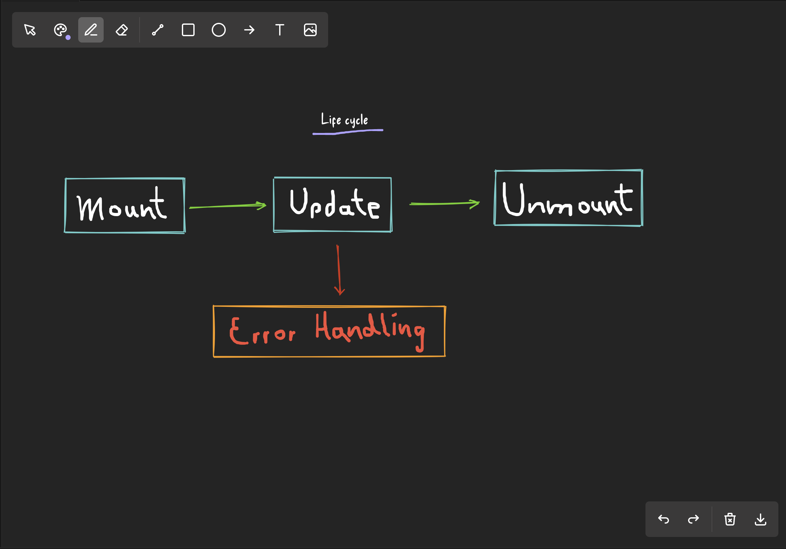

# FreeDraw

FreeDraw provides a simple and intuitive way to draw directly within your Visual Studio Code editor. Whether you need to sketch out ideas, annotate code, or create diagrams, FreeDraw has you covered.

This is an open-source project created by the community, for the community. We welcome contributions from anyone who wants to help make FreeDraw even better. Check out the [Contributing](#contributing) section below for more information.

## How It Works

1. **Installation**: Install the FreeDraw extension from the Visual Studio Code marketplace.
2. **Activation**: Activate the extension using the command palette (`Ctrl+Shift+P`) and typing `Free Draw`.
3. **Drawing**: Use your mouse or stylus to draw on the editor. You can change colors, brush sizes, and more from the toolbar.
4. **Saving**: Drawings are automatically saved locally and can be exported as images by clicking the save button in the toolbar.

## Screenshots



## Contributing

We welcome contributions from the community! To contribute:

1. Fork the repository.
2. Create a new branch for your feature or bugfix.
3. Make your changes and commit them with clear messages.
4. Push your changes to your fork.
5. Open a pull request with a description of your changes.

## License

This project is licensed under the MIT License. See the [LICENSE](LICENSE) file for details.

## Development

To test the extension:

1. Build the source code of the react app inside the `web` folder.

```bash
cd web
yarn install
yarn build
```

2. Run the Extension Development Host with `F5`.

3. Activate the extension using the command palette (`Ctrl+Shift+P`) and typing `Free Draw`.

4. Draw!

### Web

Given that this is a React app, you can test the extension in the web for quick development.

```bash
cd web
yarn install
yarn dev
```

## Release

To release a new version of the extension run the following command:

```bash
vsce package
vsce publish
```

To release the extension to the Open VSX Registry, run the following command:

```bash
yarn publish:openvsx
```
